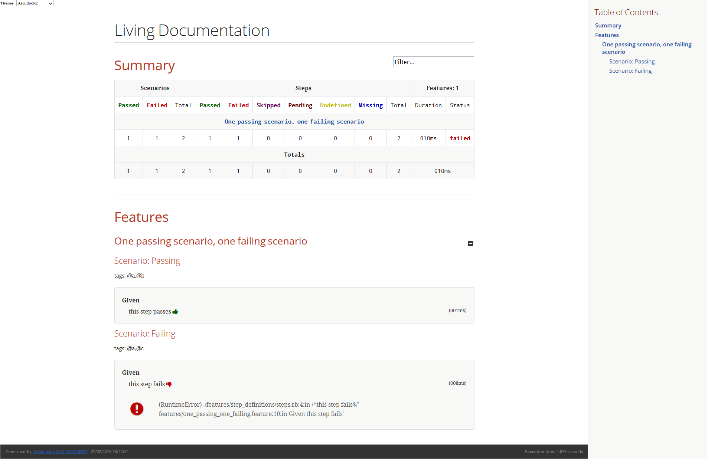

= Cukedoctor
:toc: preamble
:source-language: java
:icons: font
:linkattrs:
:sectanchors:
:sectlink:
:numbered:

[quote]
____
Enabling Behaviour driven documentation!
____

image:https://travis-ci.org/rmpestano/cukedoctor.svg[Build Status (Travis CI), link=https://travis-ci.org/rmpestano/cukedoctor]
image:https://coveralls.io/repos/rmpestano/cukedoctor/badge.svg?branch=master&service=github[Coverage, link=https://coveralls.io/r/rmpestano/cukedoctor]
image:https://maven-badges.herokuapp.com/maven-central/com.github.cukedoctor/cukedoctor/badge.svg["Maven Central",link="http://search.maven.org/#search|ga|1|cukedoctor"]
image:https://www.versioneye.com/user/projects/55d3328a265ff6002200029f/badge.svg?style=flat[Dependency Status, link=https://www.versioneye.com/user/projects/55d3328a265ff6002200029f/]

BDD living documentation using http://cukes.info/[Cucumber] and http://asciidoctor.org[Asciidoctor] based on Cucumber http://www.relishapp.com/cucumber/cucumber/docs/formatters/json-output-formatter[JSON execution output].

== Narrative

[quote]
____
In order to have awesome *living documentation* +
As a bdd developer +
I want to convert my test results into http://asciidoctor.org/docs/what-is-asciidoc/[Asciidoc format^].
____

== Story

****
[big]#*GIVEN*# I execute my cucumber tests using the json formatter

[BIG]#*AND*# cucumber json output files are generated

[big]#*WHEN*# I convert the files using Cukedoctor

[big]#*THEN*# I should have awesome _living_ documentation based on asciidoc.
****

== Sample

The following cucumber feature:

----
@a
Feature: One passing scenario, one failing scenario

  @b
  Scenario: Passing
    Given this step passes

  @c
  Scenario: Failing
    Given this step fails
----

will be converted by Cukedoctor (after tests execution) into the following document:

== Documentation Examples

Here are some bdd documentation examples generated by Cukedoctor:

[cols="1v,1v"]
|===
|Project | Living documentation

|https://github.com/asciidoctor/asciidoctor[Asciidoctor^]
|http://rmpestano.github.io/cukedoctor/asciidoctor/asciidoctor-documentation.html[html^] / http://rmpestano.github.io/cukedoctor/asciidoctor/asciidoctor-documentation.pdf[pdf^]

|https://github.com/cucumber[Cucumber (Ruby)^]
|http://rmpestano.github.io/cukedoctor/cucumber/cucumber-documentation.html[html^] / http://rmpestano.github.io/cukedoctor/cucumber/cucumber-documentation.pdf[pdf^]

|https://github.com/cucumber/cucumber-js[Cucumber JS^]
|http://rmpestano.github.io/cukedoctor/cucumber-js/cucumber-js-documentation.html[html^] / http://rmpestano.github.io/cukedoctor/cucumber-js/cucumber-js-documentation.pdf[pdf^]

|https://github.com/jekyll/jekyll[Jekyll^]
|http://rmpestano.github.io/cukedoctor/jekyll/jekyll-documentation.html[html^] / http://rmpestano.github.io/cukedoctor/cucumber-js/cucumber-js-documentation.pdf[pdf^]

|https://github.com/sdkman/sdkman-cli[Sdkman^]
|http://rmpestano.github.io/cukedoctor/sdkman/sdkman-documentation.html[html^] / http://rmpestano.github.io/cukedoctor/sdkman/sdkman-documentation.pdf[pdf^]

|===

More examples of documentation generated by Cukedoctor can be http://rmpestano.github.io/cukedoctor/[found here^]. Feel free to https://github.com/rmpestano/cukedoctor/tree/gh-pages[fork it^] and contribute yours!

== Modules

=== Maven plugin

If you use maven and execute your cucumber tests through maven you can use cukedoctor-maven plugin.
For more details see https://github.com/rmpestano/cukedoctor/tree/master/cukedoctor-maven-plugin[cukedoctor-maven-plugin].

=== Standalone jar

To use Cukedoctor as a standalone jar you can https://bintray.com/artifact/download/rmpestano/cukedoctor/com/github/cukedoctor/cukedoctor-main/0.8.0/cukedoctor-main-0.8.0.jar[download it here^]. For more details, see https://github.com/rmpestano/cukedoctor/tree/master/cukedoctor-main[cukedoctor-main].

=== Converter

Cukedoctor converter is the basis for the above projects, it generates asciidoc files based on Cucumber json execution files. For more details see https://github.com/rmpestano/cukedoctor/tree/master/cukedoctor-converter[cukedoctor-converter].

=== Extension

Cukedoctor extension adds new features to generated documentation in order to let original document cleaner and make it easier to enable/disable those features. For more details see https://github.com/rmpestano/cukedoctor/tree/master/cukedoctor-extension[cukedoctor-extension].

=== SPI example

This module provides an example project to show how cukedoctor documentation can be extended and customized. For more details see https://github.com/rmpestano/cukedoctor/tree/master/cukedoctor-spi-example[cukedoctor-spi-example].

== Distribution

Cukedoctor is available at https://bintray.com/rmpestano/cukedoctor[Bintray] and at http://search.maven.org/#search%7Cga%7C1%7Ccukedoctor[Maven central^].

*Snapshots* are available at https://oss.sonatype.org/content/repositories/snapshots/com/github/cukedoctor/[maven central^] and published on each _successful_ commit&build on travis.

You can use snapshots by adding the following snippets in pom.xml:

[source,xml]
----
<repositories>
    <repository>
        <snapshots/>
        <id>snapshots</id>
        <name>libs-snapshot</name>
        <url>https://oss.sonatype.org/content/repositories/snapshots</url>
    </repository>
</repositories>
----

TIP: You can download snapshots directly from Sonatype https://oss.sonatype.org/content/repositories/snapshots/com/github/cukedoctor/[here^].

