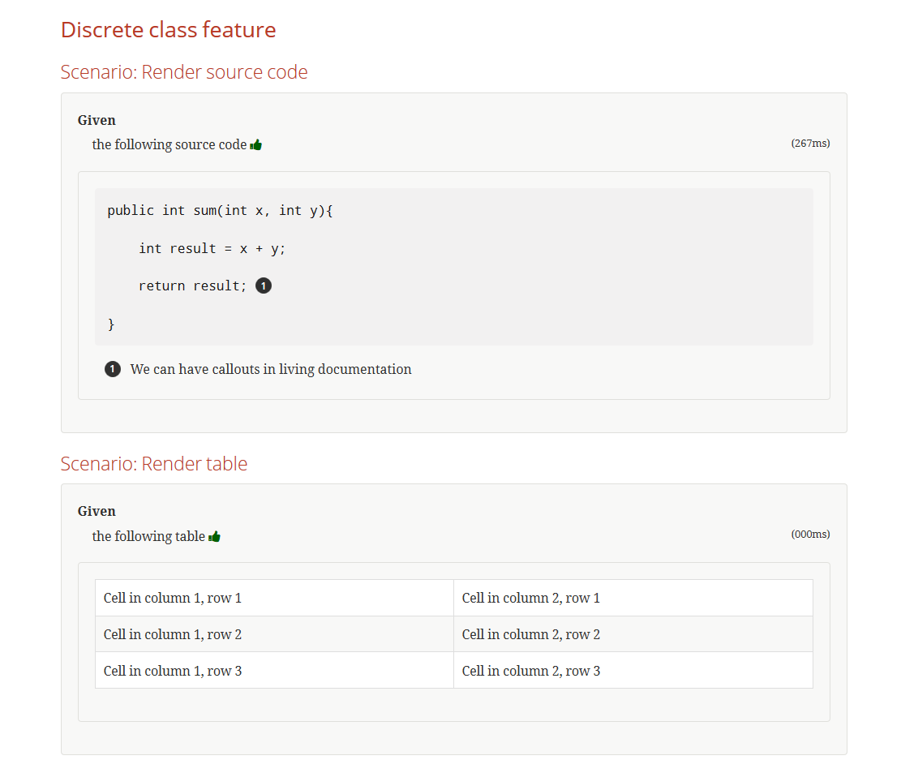
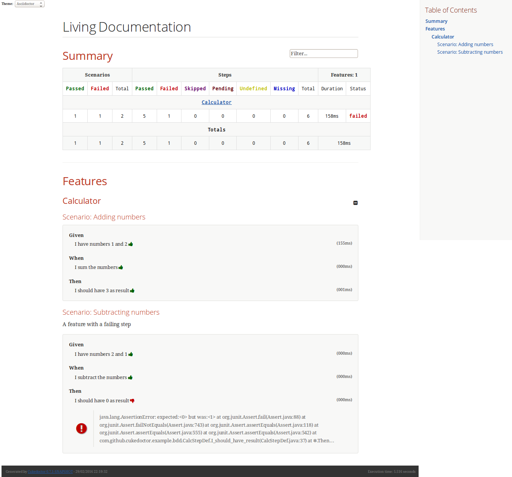

= Cukedoctor
:toc: preamble
:source-language: java
:icons: font
:linkattrs:
:sectanchors:
:sectlink:
:numbered:

[quote]
____
Enabling Behaviour driven documentation!
____

image:https://travis-ci.org/rmpestano/cukedoctor.svg[Build Status (Travis CI), link=https://travis-ci.org/rmpestano/cukedoctor]
image:https://coveralls.io/repos/rmpestano/cukedoctor/badge.svg?branch=master&service=github[Coverage, link=https://coveralls.io/r/rmpestano/cukedoctor]
image:https://maven-badges.herokuapp.com/maven-central/com.github.cukedoctor/cukedoctor/badge.svg["Maven Central",link="http://search.maven.org/#search|ga|1|cukedoctor"]
image:https://www.versioneye.com/user/projects/55d3328a265ff6002200029f/badge.svg?style=flat[Dependency Status, link=https://www.versioneye.com/user/projects/55d3328a265ff6002200029f/]

BDD living documentation using http://cukes.info/[Cucumber] and http://asciidoctor.org[Asciidoctor] based on Cucumber http://www.relishapp.com/cucumber/cucumber/docs/formatters/json-output-formatter[JSON execution output].

== Narrative

[quote]
____
In order to have awesome *living documentation* +
As a bdd developer +
I want to convert my test results into http://asciidoctor.org/docs/what-is-asciidoc/[Asciidoc format^].
____

== Story

****
[big]#*GIVEN*# I execute my cucumber tests using the json formatter

[BIG]#*AND*# cucumber json output files are generated

[big]#*WHEN*# I convert the files using Cukedoctor

[big]#*THEN*# I should have awesome _living_ documentation based on asciidoc.
****

== Sample

image::Cukedoctor-sample.png[]

The feature file for the above sample can be https://github.com/database-rider/database-rider/blob/master/rider-core/src/test/resources/features/rider-core/core-seed-database.feature[found here^].

Failing steps are rendered as follows:

image::Cukedoctor-sample-with-error.png[]

== Cukedoctor Living Documentation

As a proof of concept, https://github.com/rmpestano/Cukedoctor/tree/master/Cukedoctor-converter/src/test/java/com/github/Cukedoctor/bdd/Cukedoctor[Cukedoctor bdd tests^] output are rendered by _itself_:

* http://rmpestano.github.io/Cukedoctor/Cukedoctor-documentation.html?theme=foundation[Cukedoctor documentation html^]
* http://rmpestano.github.io/Cukedoctor/Cukedoctor-documentation.pdf[Cukedoctor documentation pdf^]
* http://rmpestano.github.io/Cukedoctor/Cukedoctor/default/Cukedoctor.html[Default cucumber formatter html^]

NOTE: This documentation is published to gh-pages by travisci on each successful build.

== Other Documentation Examples

Here are some bdd documentation examples generated by Cukedoctor:

[cols="1v,1v,lv"]
|===
|Project | Living documentation

|https://github.com/database-rider/databae-rider[Database Rider^]
|https://database-rider.github.io/database-rider/#documentation

|https://github.com/asciidoctor/asciidoctor[Asciidoctor^]
|http://rmpestano.github.io/Cukedoctor/asciidoctor/asciidoctor-documentation.html[html^] / http://rmpestano.github.io/Cukedoctor/asciidoctor/asciidoctor-documentation.pdf[pdf^]

|https://github.com/cucumber[Cucumber (Ruby)^]
|http://rmpestano.github.io/Cukedoctor/cucumber/cucumber-documentation.html[html^] / http://rmpestano.github.io/Cukedoctor/cucumber/cucumber-documentation.pdf[pdf^]

|https://github.com/cucumber/cucumber-js[Cucumber JS^]
|http://rmpestano.github.io/Cukedoctor/cucumber-js/cucumber-js-documentation.html[html^] / http://rmpestano.github.io/Cukedoctor/cucumber-js/cucumber-js-documentation.pdf[pdf^]

|https://github.com/jekyll/jekyll[Jekyll^]
|http://rmpestano.github.io/Cukedoctor/jekyll/jekyll-documentation.html[html^] / http://rmpestano.github.io/Cukedoctor/jekyll/jekyll-documentation.pdf[pdf^]

|https://github.com/sdkman/sdkman-cli[Sdkman^]
|http://rmpestano.github.io/Cukedoctor/sdkman/sdkman-documentation.html[html^] / http://rmpestano.github.io/Cukedoctor/sdkman/sdkman-documentation.pdf[pdf^]

|===

== Cukedoctor Converter

Cukedoctor converter is the basis for other modules, it generates asciidoc files based on Cucumber json execution files.

=== Usage

Just declare the plugin in your _pom.xml_:

[source, xml]
----
  <dependency>
       <groupId>com.github.Cukedoctor</groupId>
       <artifactId>Cukedoctor-converter</artifactId>
       <version>1.0.6</version>
   </dependency>
----

=== Example

[source, java]
----
@Test
public void shouldSaveDocumentationIntoDisk(){
	List<String> pathToCucumberJsonFiles = FileUtil.findJsonFiles("target/test-classes/json-output/");
	List<Feature> features = FeatureParser.parse(pathToCucumberJsonFiles);
	DocumentAttributes attrs = DefaultConfig.getInstance().getDocumentAttributes;
	attrs.toc("left").backend("html5")
			.docType("book")
			.icons("font").numbered(false)
		   .sectAnchors(true).sectLink(true);

	CukedoctorConverter converter = Cukedoctor.instance(features, "Living Documentation", attrs);
	converter.setFilename("/target/living_documentation.adoc");

	converter.saveDocumentation();
	assertThat(FileUtil.loadFile("/target/living_documentation.adoc")).exists();
}
----

[IMPORTANT]
======
To generate cucumber .json output files just execute your _BDD_ tests with *json* formatter, example:

[source,java]
----
@RunWith(Cucumber.class)
@CucumberOptions(plugin = {"json:target/cucumber.json"} )
----
NOTE: *plugin* option replaced *format* option which was deprecated in newer cucumber versions.

======

=== Introduction Chapter

You can add a custom introduction chapter to your living documentations by placing a file named *Cukedoctor-intro.adoc* anywhere on your classpath.

The content of the file will be placed between Documentation title and summary section. Here's an example of Cukedoctor-intro.adoc:

----
= *This is a sample introduction chapter*

Introduction chapter is the place where you can insert custom content for your living documentation.

=== Sub section
Introduction chapter can have subsections
----

Here is rendered documentation:

image::Cukedoctor-intro.png[]

=== Internationalization

Cukedoctor can use internationalization in two flavours:

==== Reading features

Cucumber feature languages are provided via comments in a feature file, https://github.com/cucumber/cucumber/wiki/Spoken-languages[see here^] for examples.

If your feature language is *not* supported by Cukedoctor you can https://github.com/rmpestano/Cukedoctor/tree/master/Cukedoctor-converter/src/main/resources/i18n[contribute it here^] or use a custom bundle.

==== Custom resource bundle

Another way of internationalization is to provide a custom bundle.

If you do so Cukedoctor will ignore feature language and will use provided resource bundle.

The name of the file must be *Cukedoctor.properties* and can be anywhere in your classpath.

Here are the key values you must provide to customize your documentation:

----
#sections
title.features = Features
title.summary = Summary
title.scenario = Scenario

#summary
summary.steps = Steps
summary.total = Totals
summary.duration = Duration

#result
result.passed = Passed
result.failed = Failed
result.skipped = Skipped
result.pending = Pending
result.undefined= Undefined
result.missing = Missing

----

==== Supported locales
Cukdoctor currently supports the following locales *en*, *es* and *pt*.

Here are the https://github.com/rmpestano/Cukedoctor/tree/master/Cukedoctor-converter/src/main/resources[supported locales^]

=== Disable extensions

Cukedoctor comes with some extensions to enhance and customize its documentation content, for more details see https://github.com/rmpestano/Cukedoctor/tree/master/Cukedoctor-extension#disable-extensions[Cukedoctor extensions module^].

=== Enriching documentation

==== Asciidoc markup in comments

To enrich the documentation one can use asciidoc markup inside Cucumber feature files, consider the following feature:

.feature without enrichment
----
Feature: Calculator

  Scenario: Adding numbers
   You can asciidoc markup in feature description.

    Given I have numbers 1 and 2
    When I sum the numbers
    Then I should have 3 as result
----

It will be rendered by Cukedoctor as follows:

image::no-enrich.png[]

Now if you want to enrich your _living_ documentation you can use asciidoc syntax in your feature:

.enriched feature
----
Feature: Calculator

  Scenario: Adding numbers
   You can use *asciidoc markup* in _feature_ #description#.

   NOTE: This is a very important feature!

    #{IMPORTANT: Asciidoc markup inside *steps* must be surrounded by *curly brackets*.}
    Given I have numbers 1 and 2

    # {NOTE: Steps comments are placed *before* each steps so this comment is for the *WHEN* step.}

    When I sum the numbers

    # {* this is a list of itens inside a feature step}
    # {* there is no multiline comment in gherkin}
    # {** second level list item}
    Then I should have 3 as result
----

And it will be rendered as follows:

image::enrich.png[]

==== Asciidoc markup in DocStrings

You can use Asciidoc markup in https://www.relishapp.com/cucumber/cucumber/docs/gherkin/doc-strings[feature DocStrings], see feature below:

----
Feature: Discrete class feature

  Scenario: Render source code

    # Cukedoctor-discrete
    Given the following source code
    """
[source, java]
-----
public int sum(int x, int y){
        int result = x + y;
        return result; <1>
    }
-----
<1> We can have callouts in living documentation
    """

  Scenario: Render table

    # Cukedoctor-discrete
    Given the following table
    """
|====

| Cell in column 1, row 1 | Cell in column 2, row 1
| Cell in column 1, row 2 | Cell in column 2, row 2
| Cell in column 1, row 3 | Cell in column 2, row 3

|====
    """
----

The docstrings will be rendered as follows:

IMPORTANT: By default Cukedoctor will render DocStrings as http://asciidoctor.org/docs/user-manual/\#listing-blocks[asciidoc listing^]. To enable this feature use *# Cukedoctor-discrete* comment.

=== Customizing your Living Documentation

Cukedoctor let you customize its generated documentation through Java service provider mechanism, see https://github.com/rmpestano/Cukedoctor/tree/master/Cukedoctor-spi-example[Cukedoctor-spi-example^] for example code.

=== How it works

Cukedoctor documentation customization is done through https://docs.oracle.com/javase/tutorial/ext/basics/spi.html[Java service provider] mechanism.

You just need to implement one of the interfaces in https://github.com/rmpestano/cukedoctor/tree/master/cukedoctor-converter/src/main/java/com/github/cukedoctor/spi[Cukedoctor SPI] and declare it in META-INF/services.

=== Example

Given this cucumber feature:

----
Feature: Calculator

  Scenario: Adding numbers

    Given I have numbers 1 and 2
    When I sum the numbers
    Then I should have 3 as result

  Scenario: Subtracting numbers
    A feature with a failing step

    Given I have numbers 2 and 1
    When I subtract the numbers
    Then I should have 0 as result

----

When we generate documentation using *default* cukedoctor renderers we got the following result:

==== Customizing the summary section

To customize summary one have to implement https://github.com/rmpestano/cukedoctor/blob/master/cukedoctor-converter/src/main/java/com/github/cukedoctor/spi/SummaryRenderer.java[SummaryRenderer interface]. Here is an example:

[source,java]
----
public class CustomSummaryRenderer extends AbstractBaseRenderer implements SummaryRenderer {

    @Override
    public String renderSummary(List<Feature> features) {
        docBuilder.textLine(H2(bold(i18n.getMessage("title.summary"))));
        docBuilder.textLine("This is a custom summary renderer").newLine();
        docBuilder.textLine("Number of features: "+features.size());
        docBuilder.newLine();
        ScenarioTotalizations totalization = new ScenarioTotalizations(features);
        docBuilder.append("Passed steps: ",totalization.getTotalPassedSteps(),newLine())
                .append(newLine()).append("Failed steps: ", totalization.getTotalFailedSteps(),newLine());
        return docBuilder.toString();
    }
}
----

NOTE: Abstract renderer is a template class which provides implementation of helper methods.

Now Imagine we want to render features as http://asciidoctor.org/docs/user-manual/#labeled-list[Asciidoctor labeled lists] instead of sections, see prototype below:

image::custom-feature-renderer.png[]

To do that you need to implement *FeatureRenderer* and also *ScenarioRenderer*.

[source,java]
----
public class CustomFeatureRenderer extends CukedoctorFeatureRenderer {<1>

    @Override
    public String renderFeature(Feature feature) {
        docBuilder.textLine((bold(feature.getName()))+"::").newLine();
        if (hasText(feature.getDescription())) {
            docBuilder.append("+").sideBarBlock(feature.getDescription().trim().replaceAll("\\n", " +" + newLine()));
        }

        if(feature.hasScenarios()){

            ScenarioRenderer scenarioRenderer = new CustomScenarioRenderer();
            for (Scenario scenario : feature.getScenarios()) {
                docBuilder.append(scenarioRenderer.renderScenario(scenario,feature));<2>
            }
        }

        return docBuilder.toString();
    }
}
----

<1> You can also extend default renderers as above.
<2> Here we provide a custom ScenarioRenderer but you could embed all markup in FeatureRenderer if you want but depending on complexity things can get messy.

And finally here is the custom ScenarioRenderer:

[source,java]
----
public class CustomScenarioRenderer extends CukedoctorScenarioRenderer{

    @Override
    public String renderScenario(Scenario scenario, Feature feature) {
        //need to clear because we will execute this method in a for loop
        //and contents will be appended
        docBuilder.clear();
        docBuilder.append("  "+scenario.getName()+":::",newLine());
        if(scenario.hasSteps()) {
            //here we will reuse builtin step renderer
            docBuilder.textLine("+");
            StepsRenderer stepsRenderer = new CukedoctorStepsRenderer();<1>
            docBuilder.append(stepsRenderer.renderSteps(scenario.getSteps()));
        }
        return docBuilder.toString();
    }
}
----
<1> Here we leverage default StepsRenderer that comes with Cukedoctor.

Now the output of our *customized living documentation*:

image::calc-custom-output.png[]

IMPORTANT: don't forget to register your custom implementations in https://github.com/rmpestano/cukedoctor/tree/master/cukedoctor-spi-example/src/test/resources/META-INF/services[META-INF/services] directory.

== Maven plugin

This module brings the ability to execute Cukedoctor converter through a maven plugin.

The plugin just scans *.json* cucumber execution files in _target_ dir and generates asciidoc documentation on _target/Cukedoctor_ folder.

=== Usage

Just declare the plugin in your _pom.xml_:

[source, xml]
----
<plugin>
    <groupId>com.github.Cukedoctor</groupId>
    <artifactId>Cukedoctor-maven-plugin</artifactId>
    <version>1.0.6</version>
    <executions>
        <execution>
            <goals>
                <goal>execute</goal>
            </goals>
            <phase>install</phase> <1>
        </execution>
    </executions>
</plugin>
----
<1> You need to use a phase that runs after your tests, see https://maven.apache.org/guides/introduction/introduction-to-the-lifecycle.html[maven lifecycle].

[IMPORTANT]
======
To generate cucumber .json output files just execute your tests with *json* formatter, example:

[source,java]
----
@RunWith(Cucumber.class)
@CucumberOptions(plugin = {"json:target/cucumber.json"} )
----
NOTE: *plugin* option replaced *format* option which was deprecated in newer cucumber versions.

======

=== Example of configuration

[source, xml]
----
<plugin>
    <groupId>com.github.Cukedoctor</groupId>
    <artifactId>Cukedoctor-maven-plugin</artifactId>
    <version>1.0.6</version>
         <configuration>
            <outputFileName>documentation</outputFileName> <1>
            <outputDir>docs</outputDir> <2>
            <format>pdf</format> <3>
            <toc>left</toc> <4>
            <numbered>true</numbered> <5>
            <docVersion>${project.version}</docVersion> <6>
         </configuration>
        <executions>
            <execution>
                <goals>
                    <goal>execute</goal>
                </goals>
                <phase>verify</phase>
            </execution>
        </executions>
</plugin>
----
<1> documentation filename
<2> directory name (relative to /target) to generate documetation (default is _Cukedoctor_)
<3> document format, default is html5
<4> table of content position, default is right
<5> section numbering, default is false
<6> documentation version (http://asciidoctor.org/docs/user-manual/#revision-number-date-and-remark[asciidoctor revNumber^])

[NOTE]
======
You can also execute the plugin without building the project but make sure you already have cucumber json files in build dir.

----
mvn Cukedoctor:execute
----
======

=== Configuration options

.Supported plugin configuration
[cols="1m,3,1"]
|====
|Name |Description | Default

|outputFileName
|Generated documentation file name
|documentation

|outputDir
|Directory of where documentation will be saved
|${buildDir}/Cukedoctor

|documentTitle
|Documentation title (first section)
|Living Documentation

|format
|Generated documetation format. Possible values: pdf, html, all
|html

|toc
|Table of contents position
|right

|numbered
|Section numbering
|true

|disableFilter
|Flag to disable filter
|

|disableMinimizable
|Flag to disable minimizable feature sections
|

|disableTheme
|Flag to disable theme support
|

|hideSummarySection
|When present, this flag hides `Summary` section
|

|hideFeaturesSection
|When present, this flag hides `Features` section
|

|hideScenarioKeyword
|When present, this flag `Scenario` (and `scenario outline`) keyword which prefixes each scenario;
|

|hideStepTime
|When present, this flag hides `step time` calculation on each step;
|

|hideTags
|When present, this flag hides `tags` rendering
|

|====

=== Disable extensions

You can disable https://github.com/rmpestano/Cukedoctor/tree/master/Cukedoctor-extension#disable-extensions[Cukedoctor extensions^] using the following configuration in maven plugin:

[source,xml]
----
  <configuration>
       <outputFileName>documentation</outputFileName> <1>
       <outputDir>docs</outputDir>
       <format>all</format>
       <toc>left</toc> <4>
       <disableTheme>true</disableTheme>
       <disableFilter>true</disableFilter>
       <disableMinimizable>true</disableMinimizable>
       <disableStyle>true</disableStyle>
  </configuration>

----

NOTE: The value doesn't matter, if there is something in the attribute the extension will be disabled

== Standalone jar (a.k.a *cli*)

This module brings the ability to execute cukedoctor converter as a Java main application (using command line: *java -jar*).

To use Cukedoctor as a standalone jar you can https://bintray.com/artifact/download/rmpestano/Cukedoctor/com/github/Cukedoctor/Cukedoctor-main/1.0.6/Cukedoctor-main-1.0.6.jar[download it here^].

=== Usage

This module converts generated adoc files into html and pdf, here's an example:

[source, java]
----
@Test
public void shouldRenderHtmlForOneFeature(){
	CukedoctorMain main = new CukedoctorMain();
	main.execute(new String[]{
			"-o", "\"target/document-one\"", <1>
			"-p", "\"target/test-classes/json-output/one_passing_one_failing.json\"", <2>
			"-t", "Living Documentation", <3>
			"-f", "html", <4>
			"-toc", "left", <5>
            "-numbering", "true", <6>
            "-sourceHighlighter", "coderay" <7>
		});

	File generatedFile = FileUtil.loadFile("target/document-one.html");
	assertThat(generatedFile).exists();
	}
----
<1> output file name (default is 'documentation')
<2> path to cucumber json files or directory (default is current dir - the search is recursive)
<3> Document title (default is 'Living Documentation')
<4> document format (Default is html)
<5> table of contents position (Default is right)
<6> Section numbering (Default is false)
<7> Source highlighter (Default is highlightjs)

==== Command line

Using in command line, the above test should be something like:

----
java -jar cukedoctor-main.jar
		-o "target/document-one"
		-p "target/test-classes/json-output/one_passing_one_failing.json"
		-t "Living Documentation" -f html
		-hideSummarySection
		-hideScenarioKeyword
----

==== Maven exec plugin

You can use maven exec plugin, see example:

----
<plugin>
    <groupId>org.codehaus.mojo</groupId>
    <artifactId>exec-maven-plugin</artifactId>
    <version>1.4.0</version>
    <configuration>
        <executable>java</executable>
        <arguments>
            <argument>-classpath</argument>
            <classpath />
            <argument>com.github.cukedoctor.CukedoctorMain</argument>
        </arguments>
    </configuration>
</plugin>
----

IMPORTANT: cukedoctor-main must be on your classpath

To invoke Cukedoctor just use:

----
mvn exec:exec
----

It will run with default args. To provide arguments, in this approach, you'll have a bit more work: http://stackoverflow.com/questions/15013651/using-maven-execexec-with-arguments[see here].

=== Disable extensions

You can disable https://github.com/rmpestano/cukedoctor/tree/master/cukedoctor-extension#disable-extensions[cukedoctor extensions^] by using _-D_ option when executing Cukedoctor main at command line:

----
java -jar -Dcukedoctor.disable.filter=123  -Dcukedoctor.disable.theme=abc
		cukedoctor-main-1.0.6.jar
		-p cucumber-output.json
----

You can download Cukedoctor main https://bintray.com/artifact/download/rmpestano/cukedoctor/com/github/cukedoctor/cukedoctor-main/1.0.6/cukedoctor-main-1.0.6.jar[jar here^]

=== Layout configuration

Some pieces of documentation can be hidden via configuration.

You can hide `Features` and `Summary` sections, as well as `scenario keyword` which prefixes each scenario and hide `tags` or `step time`. To do so just specify the following arg parameters respectively:

----
java -jar -Dcukedoctor.disable.filter=123  -Dcukedoctor.disable.theme=abc
		cukedoctor-main-1.0.6.jar
		-p cucumber-output.json
		-hideFeaturesSection <1>
		-hideSummarySection <2>
		-hideScenarioKeyword <3>
		-hideStepTime <4>
		-hideTags <5>
----
<1> Removes `Features` section so each feature is a section instead of a sub section of `Features`;
<2> Removes summary section
<3> Removes `scenario` keyword which prefixes each scenario;
<4> Removes step time calculation on each step;
<5> Removes tags rendering;

== Extension

Cukedoctor extension adds new features to generated documentation in order to let original document cleaner and make it easier to enable/disable those features.

This module extend cukedoctor generated documentation via http://asciidoctor.org/docs/asciidoctorj/#extension-api[Asciidoctor extensions mechanism^].

Cukedoctor comes with 5 extensions to enhance documentation content:

* *Filter extension* which lets features to be filtered using an input at top right of the page;

* *Minimizable extension* which lets you minimize/maximize features sections (minus/plus icon next to feature name);

* *Theme extension* to add theme support.

* *Footer* add cukedoctor footer.

* *Style* customizes Asciidoctor stylesheet.

NOTE: All extensions target html documentation.

=== Disable extensions

To disable extensions just set the following system properties:

[source,java]
----
   System.setProperty("cukedoctor.disable.theme","anyValue");

   System.setProperty("cukedoctor.disable.filter","anyValue");

   System.setProperty("cukedoctor.disable.minmax","anyValue");

   System.setProperty("cukedoctor.disable.footer","anyValue");

   System.setProperty("cukedoctor.disable.style","anyValue");

----

NOTE: The value doesn't matter, if there is something in the system property the extension will be disabled.

[TIP]
====
You can re-enable the extensions by calling

[source,java]
----
    System.clearProperty("cukedoctor.disable.theme");

    System.clearProperty("cukedoctor.disable.filter");

    System.clearProperty("cukedoctor.disable.minmax");

    System.clearProperty("cukedoctor.disable.footer");

    System.clearProperty("cukedoctor.disable.style");
----
====

== Jenkins plugin

Cukedoctor brings Living documentation to Jenkins via https://wiki.jenkins-ci.org/display/JENKINS/Cucumber+Living+Documentation+Plugin[Cucumber living documentation plugin^].

== Distribution

Cukedoctor is available at https://bintray.com/rmpestano/Cukedoctor[Bintray] and at http://search.maven.org/#search%7Cga%7C1%7CCukedoctor[Maven central^].

*Snapshots* are available at https://oss.sonatype.org/content/repositories/snapshots/com/github/Cukedoctor/[maven central^] and published on each _successful_ commit&build on travis.

You can use snapshots by adding the following snippets in pom.xml:

[source,xml]
----
<repositories>
    <repository>
        <snapshots/>
        <id>snapshots</id>
        <name>libs-snapshot</name>
        <url>https://oss.sonatype.org/content/repositories/snapshots</url>
    </repository>
</repositories>
----

TIP: You can download snapshots directly from Sonatype https://oss.sonatype.org/content/repositories/snapshots/com/github/Cukedoctor/[here^].

== Contributing

* Found a bug? open an https://github.com/rmpestano/Cukedoctor/issues[issue^] and attach your https://github.com/rmpestano/Cukedoctor/tree/master/Cukedoctor-converter/src/test/resources/json-output[feature json^] output to it;
* Have an idea? open an issue and lets discuss it;
* Any form of feedback is more than welcome!

