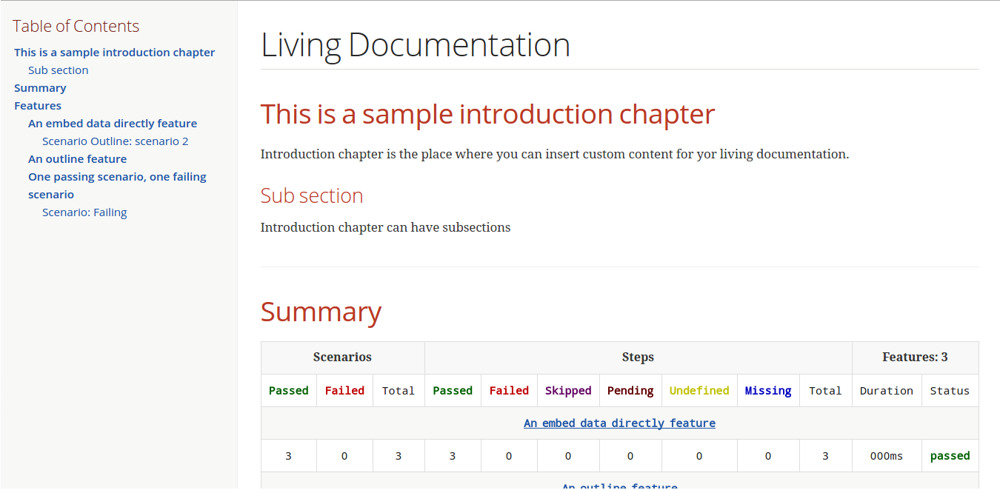

= Cukedoctor Converter module

image:https://www.versioneye.com/user/projects/55d3325e265ff6001a000204/badge.svg?style=flat[Dependency Status, link=https://www.versioneye.com/user/projects/55d3325e265ff6001a000204/]

This module is responsible for generating adoc files from .json cucumber execution files.

== Example

[source, java]
----
@Test
public void shouldSaveDocumentationIntoDisk(){
	List<String> pathToCucumberJsonFiles = FileUtil.findJsonFiles("target/test-classes/json-output/");
	List<Feature> features = FeatureParser.parse(pathToCucumberJsonFiles);
	DocumentAttributes attrs = new DocumentAttributes();
	attrs.toc("left").backend("html5")
			.docType("book")
			.icons("font").numbered(false)
		.sectAnchors(true).sectLink(true);

	CukedoctorConverter converter = Cukedoctor.instance(features, "Living Documentation", attrs);
	converter.setFilename("/target/living_documentation.adoc");

	converter.saveDocumentation();
	assertThat(FileUtil.loadFile("/target/living_documentation.adoc")).exists();
}
----

[IMPORTANT]
====
To generate cucumber .json output files just execute your _BDD_ tests with *json* formatter, example:

[source,java]
----
@RunWith(Cucumber.class)
@CucumberOptions(plugins = {"json:target/cucumber.json"} )
----
NOTE: *plugins* option replaced *format* option which was deprecated in newer cucumber versions.

====

== Introduction Chapter

You can add a custom introduction chapter to your living documentations by placing a file named *cukedoctor-intro.adoc* anywhere on your classpath.

The content of the file will be placed between Documentation title and summary section. Here's an example of cukedoctor-intro.adoc:

----
= *This is a sample introduction chapter*

Introduction chapter is the place where you can insert custom content for your living documentation.

== Sub section
Introduction chapter can have subsections
----

Here is rendered documentation:

== Internationalization

Cukedoctor can use internationalization in two flavours:

=== Reading features

Cucumber feature languages are provided via comments in a feature file, https://github.com/cucumber/cucumber/wiki/Spoken-languages[see here^] for examples.

If your feature language is *not* supported by Cukedoctor you can https://github.com/rmpestano/cukedoctor/tree/master/cukedoctor-converter/src/main/resources/i18n[contribute it here^] or use a custom bundle.

=== Custom resource bundle

Another way of internationalization is to provide a custom bundle.

If you do so Cukedoctor will ignore feature language and will use provided resource bundle.

The name of the file must be *cukedoctor.properties* and can be anywhere in your classpath.

Here are the key values you must provide to customize your documentation:

----
title.features = Features
title.summary = Summary
title.scenario = Scenario

#result
result.passed = Passed
result.failed = Failed
result.skipped = Skipped
result.pending = Pending
result.undefined= Undefined
result.missing = Missing
----

=== Supported locales
Cukdoctor currently supports the following locales *en*, *es* and *pt*.

Here are the https://github.com/rmpestano/cukedoctor/tree/master/cukedoctor-converter/src/main/resources[supported locales^]

== Maven coordinates

[source,xml]
----
 <dependency>
      <groupId>com.github.cukedoctor</groupId>
      <artifactId>cukedoctor-converter</artifactId>
      <version>0.7.0</version>
  </dependency>
----
