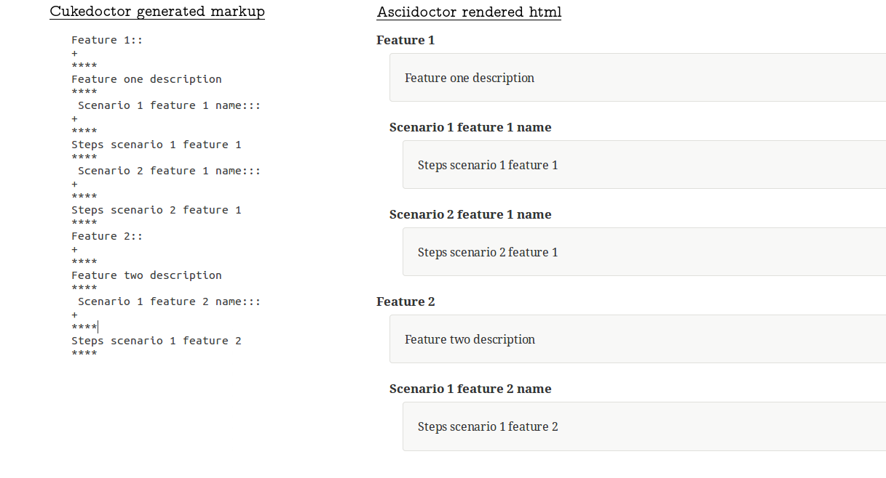
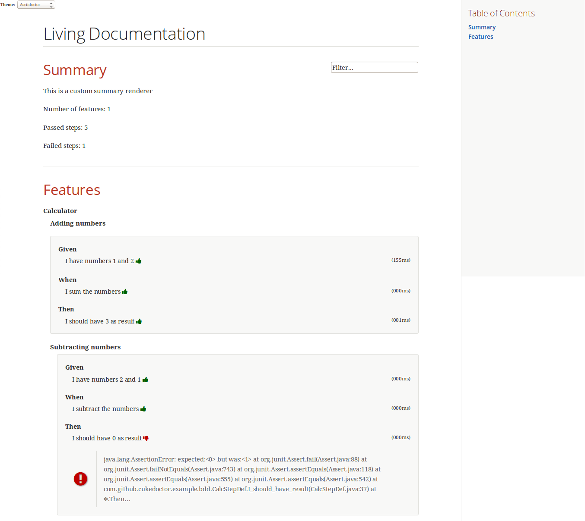

= Cukedoctor SPI Example

This module shows an example of how to customize Cukedoctor documentation through its SPI.

== How it works

Cukedoctor documentation customization is done through https://docs.oracle.com/javase/tutorial/ext/basics/spi.html[Java service provider] mechanism.

You just need to implement one of the interfaces in https://github.com/rmpestano/cukedoctor/tree/master/cukedoctor-converter/src/main/java/com/github/cukedoctor/spi[Cukedoctor SPI] and declare it in META-INF/services.

== Example

Given this cucumber feature:

----
Feature: Calculator

  Scenario: Adding numbers

    Given I have numbers 1 and 2
    When I sum the numbers
    Then I should have 3 as result

  Scenario: Subtracting numbers
    A feature with a failing step

    Given I have numbers 2 and 1
    When I subtract the numbers
    Then I should have 0 as result

----

When we generate documentation using *default* cukedoctor renderers we got the following result:

image::calc-original-output.png[]

=== Customizing the summary section

To customize summary one have to implement https://github.com/rmpestano/cukedoctor/blob/master/cukedoctor-converter/src/main/java/com/github/cukedoctor/spi/SummaryRenderer.java[SummaryRenderer interface]. Here is an example:

[source,java]
----
public class CustomSummaryRenderer extends AbstractBaseRenderer implements SummaryRenderer {

    @Override
    public String renderSummary(List<Feature> features) {
        docBuilder.textLine(H2(bold(i18n.getMessage("title.summary"))));
        docBuilder.textLine("This is a custom summary renderer").newLine();
        docBuilder.textLine("Number of features: "+features.size());
        docBuilder.newLine();
        ScenarioTotalizations totalization = new ScenarioTotalizations(features);
        docBuilder.append("Passed steps: ",totalization.getTotalPassedSteps(),newLine())
                .append(newLine()).append("Failed steps: ", totalization.getTotalFailedSteps(),newLine());
        return docBuilder.toString();
    }
}
----

NOTE: Abstract renderer is a template class which provides implementation of helper methods.

Now Imagine we want to render features as http://asciidoctor.org/docs/user-manual/#labeled-list[Asciidoctor labeled lists] instead of sections, see prototype below:

To do that you need to implement *FeatureRenderer* and also *ScenarioRenderer*.

[source,java]
----
public class CustomFeatureRenderer extends CukedoctorFeatureRenderer {<1>

    @Override
    public String renderFeature(Feature feature) {
        docBuilder.textLine((bold(feature.getName()))+"::").newLine();
        if (hasText(feature.getDescription())) {
            docBuilder.append("+").sideBarBlock(feature.getDescription().trim().replaceAll("\\n", " +" + newLine()));
        }

        if(feature.hasScenarios()){

            ScenarioRenderer scenarioRenderer = new CustomScenarioRenderer();
            for (Scenario scenario : feature.getScenarios()) {
                docBuilder.append(scenarioRenderer.renderScenario(scenario,feature));<2>
            }
        }

        return docBuilder.toString();
    }
}
----

<1> You can also extend default renderers as above.
<2> Here we provide a custom ScenarioRenderer but you could embed all markup in FeatureRenderer if you want but depending on complexity things can get messy.

And finally here is the custom ScenarioRenderer:

[source,java]
----
public class CustomScenarioRenderer extends CukedoctorScenarioRenderer{

    @Override
    public String renderScenario(Scenario scenario, Feature feature) {
        //need to clear because we will execute this method in a for loop
        //and contents will be appended
        docBuilder.clear();
        docBuilder.append("  "+scenario.getName()+":::",newLine());
        if(scenario.hasSteps()) {
            //here we will reuse builtin step renderer
            docBuilder.textLine("+");
            StepsRenderer stepsRenderer = new CukedoctorStepsRenderer();<1>
            docBuilder.append(stepsRenderer.renderSteps(scenario.getSteps()));
        }
        return docBuilder.toString();
    }
}
----
<1> Here we leverage default StepsRenderer that comes with Cukedoctor.

Now the output of our *customized living documentation*:

IMPORTANT: don't forge to register your custom implementations in https://github.com/rmpestano/cukedoctor/tree/master/cukedoctor-spi-example/src/test/resources/META-INF/services[META-INF/services] directory.